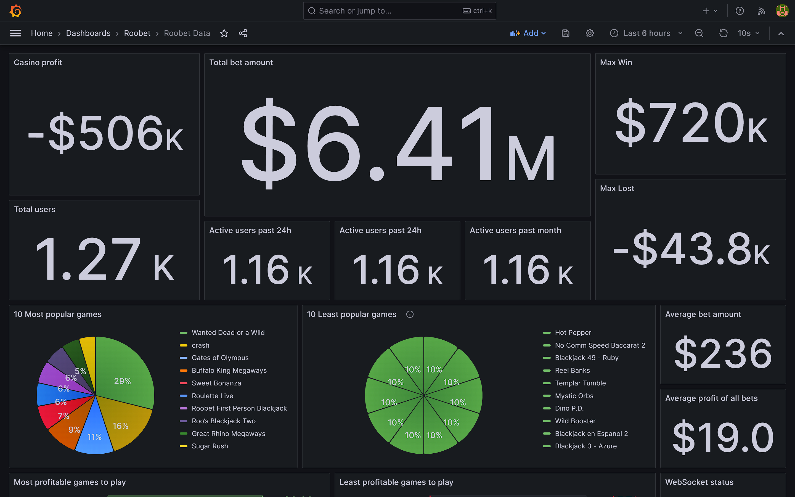

# Roobet Websocket Scraper

Simple websocket scraper that scrapes [roobet.party](https://roobet.party/) and sends data to db.
I don't have enough skills and the code is trash, but it works.
It also has a lot of bugs, sometimes websocket just disconnects.

I was interested about this table with bets, so I made this scraper.


I wanted to analyze whether the data is real. I made simple dashboard in grafana to visualize the data.
I'm not sure if it's real, but it looks like it is. We will see.

## Set up

```bash
git clone https://github.com/LosBagros/roobet-scraper
cd roobet-scraper
mv .env.example .env
vi .env # set up your credentials (feel free to use any editor)
docker-compose up --build -d
```

I have a `skill-issue` and I can't export the grafana config, when I'm done I'll put it here


## Screenshots


