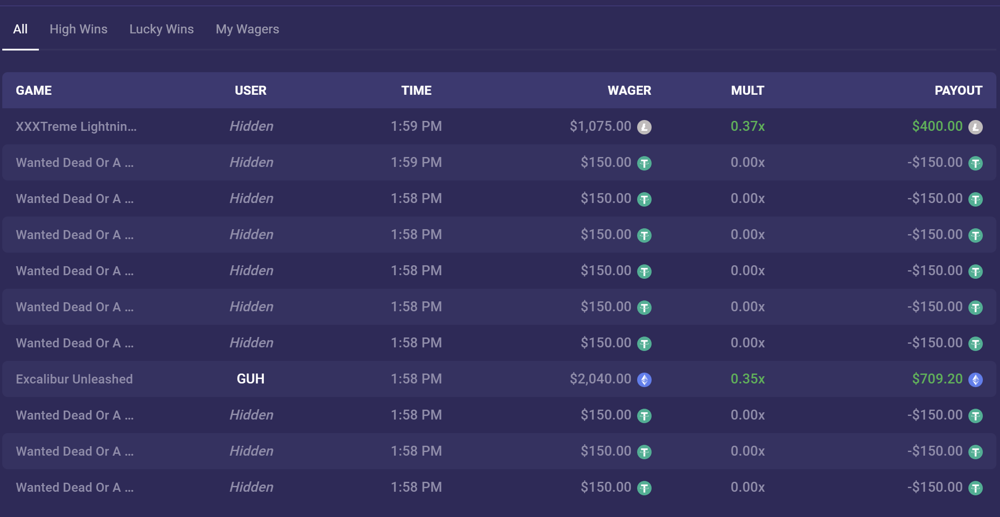
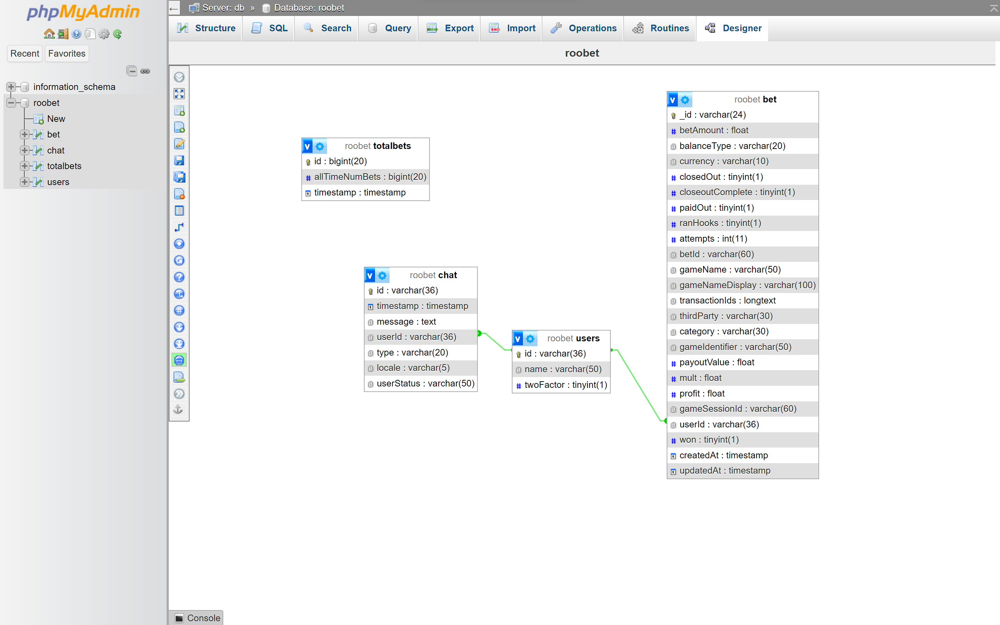
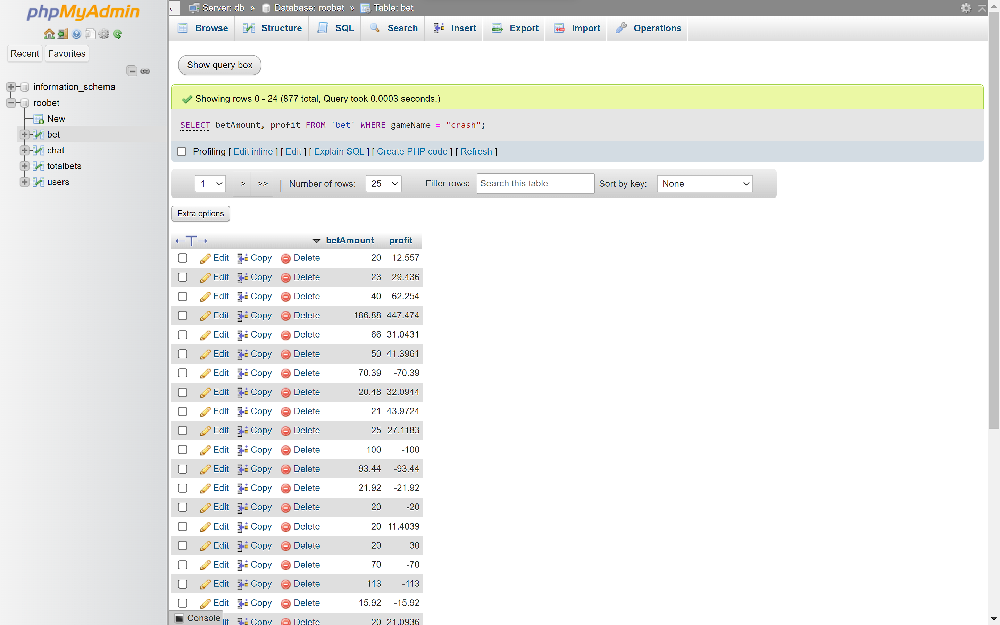
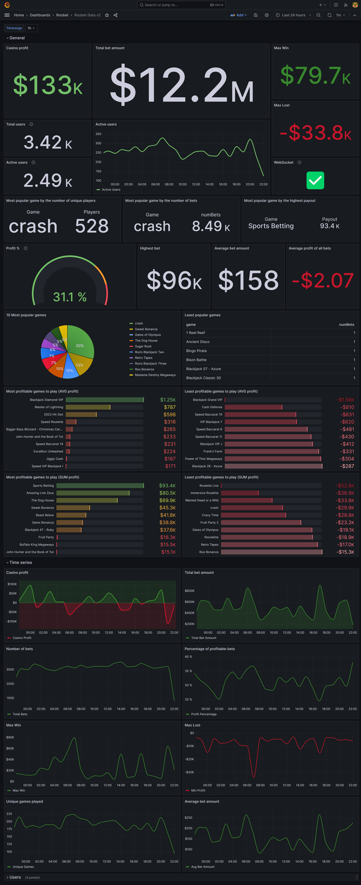
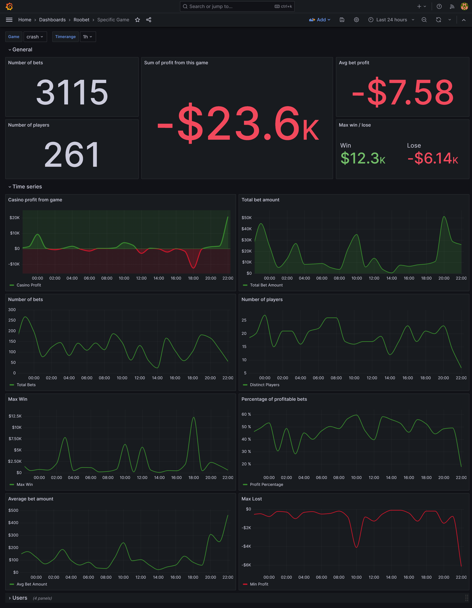

# Roobet Websocket Scraper

Simple websocket scraper that scrapes [roobet.party](https://roobet.party/) and sends data to db.
I don't have enough skills and the code is trash, but it works.
It also has a lot of bugs, sometimes websocket just disconnects.

I was interested about this table with bets, so I made this scraper.



I wanted to analyze whether the data is real. I made simple dashboard in grafana to visualize the data.
I'm not sure if it's real, but it looks like it is. We will see.

## To do list

Need to fix db design, it's trash. Missing some columns. It could be done better.
- [ ] start saving anonymous users
- [ ] don't know what to do when bet changes (save it as new bet or update the old one, now it's not saving because same primary key)

Need to find out difference between timestamp, closeoutTimestamp, createdAt, updatedAt, addedAt
## Set up

```bash
git clone https://github.com/LosBagros/roobet-scraper
cd roobet-scraper
mv .env.example .env
vi .env # set up your credentials (feel free to use any editor)
docker-compose up --build -d
```


## Screenshots



